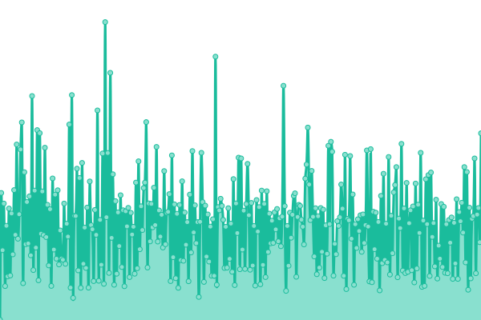
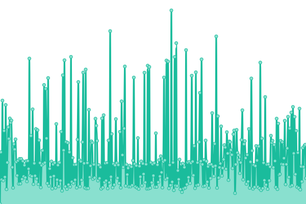
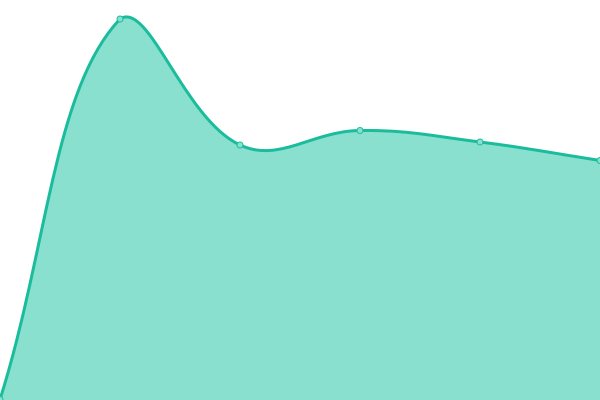
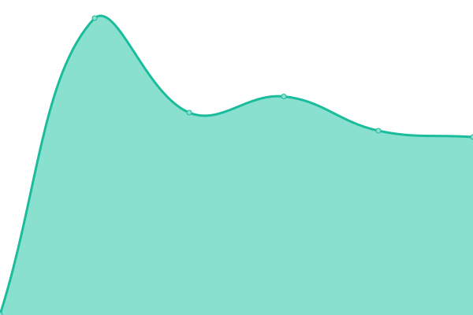

# [📈 Live Status](https://cedmax.github.io/upptime): <!--live status--> **🟧 Partial outage**

This repository contains the open-source uptime monitor and status page for [Marco Cedaro](https://cedmax.com), powered by [Upptime](https://github.com/upptime/upptime).

With [Upptime](https://upptime.js.org), you can get your own unlimited and free uptime monitor and status page, powered entirely by a GitHub repository. We use [Issues](https://github.com/cedmax/upptime/issues) as incident reports, [Actions](https://github.com/cedmax/upptime/actions) as uptime monitors, and [Pages](https://cedmax.github.io/upptime) for the status page.

<!--start: status pages-->
<!-- This summary is generated by Upptime (https://github.com/upptime/upptime) -->
<!-- Do not edit this manually, your changes will be overwritten -->
<!-- prettier-ignore -->
| URL | Status | History | Response Time | Uptime |
| --- | ------ | ------- | ------------- | ------ |
|  [cedmax.net](https://cedmax.net/ghost) | 🟩 Up | [cedmax-net.yml](https://github.com/cedmax/upptime/commits/HEAD/history/cedmax-net.yml) | 

 618ms
     
 | 

<a href="https://cedmax.github.io/upptime/history/cedmax-net">63.01%</a>
    

|  [kennel](https://k.cedmax.net/ghost) | 🟥 Down | [kennel.yml](https://github.com/cedmax/upptime/commits/HEAD/history/kennel.yml) | 

 624ms
     
 | 

<a href="https://cedmax.github.io/upptime/history/kennel">63.71%</a>
    

|  [edamiani](https://notes.emanueladamiani.com/) | 🟩 Up | [edamiani.yml](https://github.com/cedmax/upptime/commits/HEAD/history/edamiani.yml) | 

 540ms
     
 | 

<a href="https://cedmax.github.io/upptime/history/edamiani">100.00%</a>
    

|  [trashme.me](https://trashme.me/) | 🟩 Up | [trashme-me.yml](https://github.com/cedmax/upptime/commits/HEAD/history/trashme-me.yml) | 

 671ms
     
 | 

<a href="https://cedmax.github.io/upptime/history/trashme-me">100.00%</a>
    

|  [graphtv](https://graphtv.dsgn.it/) | 🟩 Up | [graphtv.yml](https://github.com/cedmax/upptime/commits/HEAD/history/graphtv.yml) | 

 603ms
     
 | 

<a href="https://cedmax.github.io/upptime/history/graphtv">100.00%</a>
    

|  [baas](https://baas.dsgn.it/) | 🟩 Up | [baas.yml](https://github.com/cedmax/upptime/commits/HEAD/history/baas.yml) | 

 556ms
     
 | 

<a href="https://cedmax.github.io/upptime/history/baas">100.00%</a>
    

<!--end: status pages-->

[**Visit our status website →**](https://cedmax.github.io/upptime)

## 📄 License

- Powered by: [Upptime](https://github.com/upptime/upptime)
- Code: [MIT](./LICENSE) © [Marco Cedaro](https://cedmax.com)
- Data in the `./history` directory: [Open Database License](https://opendatacommons.org/licenses/odbl/1-0/)
